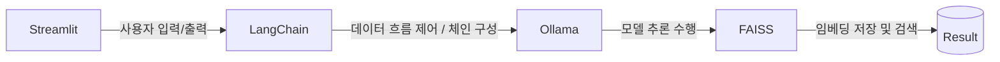

# Recipe Chatbot Project
## 프로젝트 소개 및 목표
### 레시피 추천 챗봇
* 사용자 맞춤형 대체 재료로 요리를 추천하는 RAG(Retrieval-Augmented Generation) 기반 스마트 레시피 챗봇

## 팀원 소개 및 역할 분담
  | Name | Role |
  |----|----|
  | 남대문 | Presentation prepare |
  | 성시경 | Data management |
  | 장태규 | Project lead, Architect |
  | 최종인 | UI design |

## 기술 스택 (Tech Stack)
- [x] **Python**  
  - 프로젝트의 **기본 언어**로, 데이터 처리, 백엔드 로직 구현에 사용
  - Python3.12 version 사용

- [x] **Streamlit**  
  - Python 기반 **웹 애플리케이션 프레임워크**로, LLM 기능을 시각적으로 제공하고 사용자 입력 처리
  - 프로토타입(데모) 개발에 적합

- [x] **LangChain**  
  - LLM, 데이터베이스, 외부 모듈 간의 연결을 관리하는 오픈소스 **AI 파이프라인 구성 프레임워크**

- [x] **FAISS**  
  - 문서 임베딩을 저장하고 유사도를 기반으로 검색하는 **벡터 데이터베이스 엔진**

- [x] **Ollama**  
  - 로컬 환경에서 LLM을 실행, 관리하는 **AI 모델 서버**로, LangChain과 연동되어 모델 추론 수행
  - 사용 모델은 **llama3.1:8b**

## 기능 설명
### 주요 기능
 - 레시피 검색
   - 사용자가 원하는 레시피를 키워드나 재료로 검색하여 다양한 요리법을 추천합니다.
 - 레시피 중 대체 가능 재료 설명
   - 특정 재료가 부족할 경우, 대체할 수 있는 재료를 제안하여 사용자가 쉽게 레시피를 수정할 수 있게 도와줍니다.
### 추가 기능
 - 필터링/검색 옵션
    - 레시피를 검색할 때, 조리 시간, 난이도 등 다양한 필터를 적용하여 더 정확한 결과를 제공합니다.
 - 스트리밍 응답
    - 사용자에게 실시간으로 빠르게 답변을 제공하는 스트리밍 기능을 통해 자연스러운 대화 흐름을 지원합니다.
 - 추천 시스템(연계 질문)
    - 사용자의 질문에 따라 연관된 레시피나 재료를 추천하여, 대화형 인터페이스를 더욱 향상시킵니다.
 - 답변 PDF 생성
    - 사용자가 받은 레시피나 정보를 PDF로 쉽게 다운로드하여, 언제든지 참조할 수 있도록 돕습니다.

## 설치 및 실행 방법
 1. 모델의 데이터 임베딩을 기다린다.
 2. 임베딩이 완료된 후, 원하는 레시피를 입력한다.
 3. 원하는 레시피 정보를 획득한다.

## 데이터 출처 
 

 - 농식품 빅데이터 거래소 : **무료 레시피 데이터**(만개의레시피) 23~25년도 데이터

 

## 한계점 및 개선 방향 
### 한계점
 - 조리법 미포함, 국내 레시피만 포함, 레시피 중복 등의 데이터 문제
 - Streamlit의 제한된 UI 커스터마이징과 모듈화/컴포넌트 구조 부족
### 개선 방향
 - 외국 레시피 데이터 추가
 - Streamlit 이외의 다른 웹 프레임워크 사용