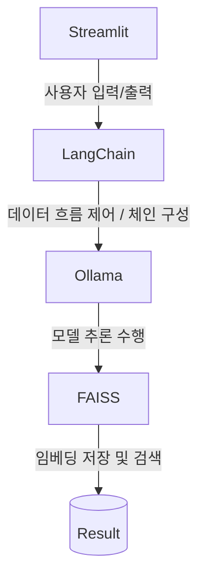

# RAG_team_project_repo
## 프로젝트 소개 및 목표
### 레시피 추천 챗봇
* 일부 재료를 대체하여 추천해줄 수 있는 요리전문가 챗봇
## 팀원 소개 및 역할 분담
  | Name | Role |
  |----|----|
  | 남대문 | Presentation prepare |
  | 성시경 | Data management |
  | 장태규 | Project lead, Architect |
  | 최종인 | UI design |
## 기술 스택 (Tech Stack)
- [x] **Python**  
  - 프로젝트의 **기본 언어**로, 데이터 처리, 백엔드 로직 구현에 사용

- [x] **Streamlit**  
  - **웹 애플리케이션 프레임워크**로, LLM 기능을 시각적으로 제공하고 사용자 입력 처리

- [x] **LangChain**  
  - LLM, 데이터베이스, 외부 모듈 간의 연결을 관리하는 **AI 파이프라인 구성 프레임워크**

- [x] **FAISS**  
  - 문서 임베딩을 저장하고 유사도를 기반으로 검색하는 **벡터 데이터베이스 엔진**

- [x] **Ollama**  
  - 로컬 환경에서 LLM을 실행, 관리하는 **AI 모델 서버**로, LangChain과 연동되어 모델 추론 수행
  - 사용 모델은 **llama3.1:8b**

## 기능 설명
### 주요 기능
 - 레시피 검색
 - 레시피 중 대체 가능 재료 설명
### 추가 기능
 - 필터링/검색 옵션
 - 스트리밍 응답
 - 추천 시스템(연계 질문)
 - 답변 PDF 생성
## 설치 및 실행 방법
 1. 모델의 데이터 임베딩을 기다린다.
 2. 임베딩이 완료된 후, 원하는 레시피를 입력한다.
 3. 원하는 레시피 정보를 획득한다.
## 데이터 출처 
 

 - 농식품 빅데이터 거래소:무료 레시피 데이터(만개의레시피) 23~25년도 데이터

 

## 한계점 및 개선 방향 
### 한계점
 - 조리법 미포함, 국내 레시피만 포함, 레시피 중복 등의 데이터 문제
 - Streamlit의 제한된 UI 커스터마이징과 모듈화/컴포넌트 구조 부족
### 개선 방향
 - 조리법, 알레르기 등의 데이터 추가
 - 검색 요리와 어울리는 다른 요리 추천